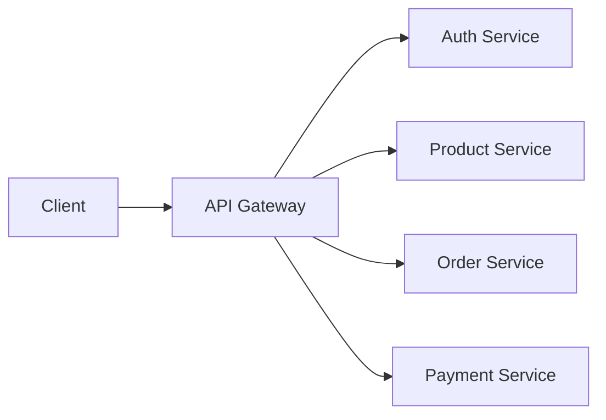
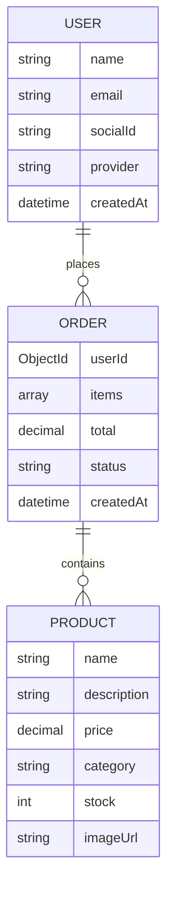

# E-commerce Architecture Document

## 1. Directory Structure
```
e-commerce/
├── frontend/          # React application
│   ├── public/
│   ├── src/
│   │   ├── assets/    # Static assets
│   │   ├── components # Reusable UI components
│   │   ├── pages/     # Page components
│   │   ├── services/  # API service calls
│   │   ├── styles/    # Global styles
│   │   ├── App.jsx
│   │   └── index.jsx
│   ├── package.json
│   └── .env
├── backend/           # Node.js application
│   ├── config/        # Configuration files
│   ├── controllers/   # Route controllers
│   ├── models/        # MongoDB models
│   ├── routes/        # API routes
│   ├── middleware/    # Custom middleware
│   ├── utils/         # Utility functions
│   ├── .env
│   └── server.js
└── .gitignore
```

## 2. Tech Stack Choices
- **Frontend**: React 18 + Vite
- **UI Framework**: Chakra UI
- **State Management**: React Query
- **Backend**: Node.js 20 + Express
- **Database**: MongoDB Atlas (cloud)
- **Authentication**: Passport.js with OAuth2
- **API Testing**: Postman
- **Deployment**: Docker + Kubernetes
- **Monitoring**: New Relic

## 3. API Design


### Core Endpoints:
- `POST /auth/login` - Social login (Google/Facebook)
- `GET /products` - Product listing with pagination
- `POST /orders` - Create new order
- `GET /orders/{id}` - Order details
- `POST /payments` - Initiate payment

## 4. Database Schema


## 5. Responsive Design Approach
1. **Mobile-First**: Design for smallest screens first
2. **Chakra Breakpoints**:
   - Base: <30em (mobile)
   - Sm: 30em-48em (tablet)
   - Md: 48em-62em (small desktop)
   - Lg: 62em-80em (desktop)
   - Xl: >80em (large desktop)
3. **Component Patterns**:
   - Flexbox for layout
   - Grid for product listings
   - `useBreakpointValue` for conditional rendering
4. **Image Optimization**: Responsive images with `srcset`
5. **Touch Targets**: Minimum 48x48px interactive elements